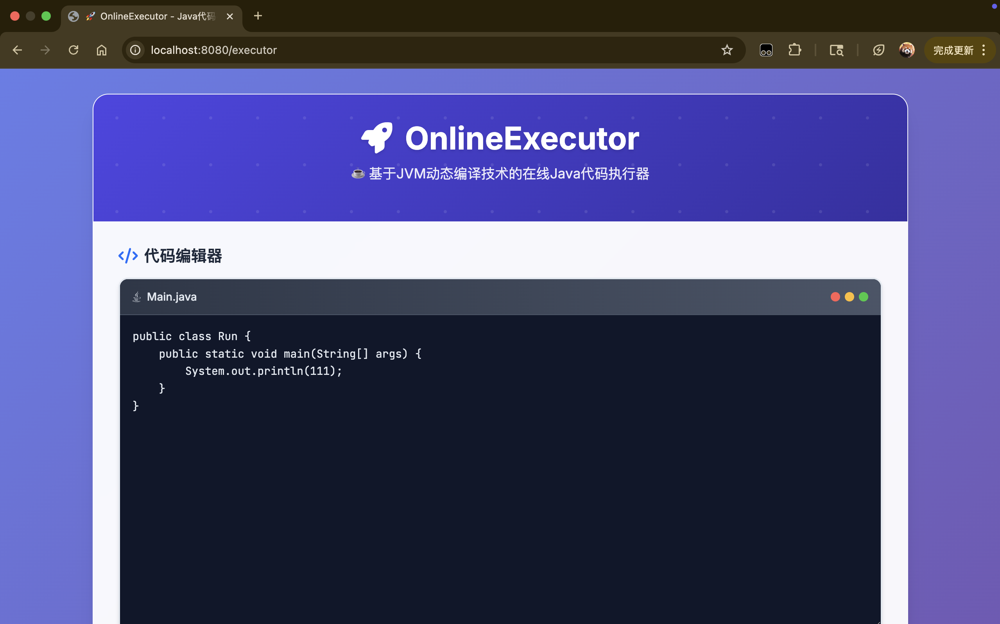
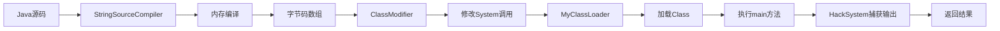

# 🚀 OnlineExecutor

[](https://www.oracle.com/java/)
[](https://spring.io/projects/spring-boot)
[](https://maven.apache.org/)
[](LICENSE)

**在线Java代码执行器** - 基于JVM动态编译技术的Web应用

> 📚 参考《深入理解Java虚拟机》第9.3节：实战-自己动手实现远程执行功能

## ✨ 特性

- 🌐 **在线编译执行**：无需本地环境，浏览器中直接运行Java代码
- 🔄 **实时编译**：基于内存的动态编译，无临时文件
- 🛡️ **安全隔离**：自定义ClassLoader和SecurityManager
- 🎯 **现代界面**：玻璃拟态设计风格，支持代码高亮和快捷键
- ⚡ **快速响应**：毫秒级编译和执行

## 🖼️ 界面预览




## 🏗️ 技术架构

### 核心组件

| 组件 | 功能 | 实现文件 |
|------|------|----------|
| **StringSourceCompiler** | 动态编译器 | [StringSourceCompiler.java](src/main/java/com/shao/compile/StringSourceCompiler.java) |
| **MyClassLoader** | 自定义类加载器 | [MyClassLoader.java](src/main/java/com/shao/execute/MyClassLoader.java) |
| **HackSystem** | 输出流重定向 | [HackSystem.java](src/main/java/com/shao/execute/HackSystem.java) |
| **ClassModifier** | 字节码修改器 | [ClassModifier.java](src/main/java/com/shao/execute/ClassModifier.java) |
| **JavaClassExecutor** | 代码执行器 | [JavaClassExecutor.java](src/main/java/com/shao/execute/JavaClassExecutor.java) |

### 技术栈

- **后端框架**：Spring Boot 2.6.2 + Spring MVC
- **模板引擎**：Thymeleaf
- **编译技术**：Java Compiler API (javax.tools)
- **类加载**：自定义ClassLoader
- **字节码操作**：ASM框架替代方案

## 🚀 快速开始

### 环境要求

- **Java**: 8+ (推荐17+)
- **Maven**: 3.6+
- **内存**: 最小512MB

### 运行步骤

1. **克隆项目**
   ```bash
   git clone https://github.com/shaojunying/OnlineExecutor.git
   cd OnlineExecutor
   ```

2. **编译项目**
   ```bash
   mvn clean compile
   ```

3. **启动应用**
   ```bash
   mvn spring-boot:run
   ```

4. **访问应用**
   ```
   http://localhost:8080/executor
   ```
   
   > 💡 **使用提示**：支持快捷键 `Ctrl+Enter` 运行代码，`Ctrl+L` 清空输出

### Docker运行 (可选)

```bash
# 构建镜像
docker build -t online-executor .

# 运行容器
docker run -p 8080:8080 online-executor
```

## 💻 使用示例

### 基础示例
```java
public class HelloWorld {
    public static void main(String[] args) {
        System.out.println("Hello, OnlineExecutor!");
    }
}
```

### 复杂示例
```java
import java.util.*;

public class Algorithm {
    public static void main(String[] args) {
        List<Integer> numbers = Arrays.asList(3, 1, 4, 1, 5, 9, 2, 6);
        Collections.sort(numbers);
        System.out.println("排序结果: " + numbers);
        
        // 计算斐波那契数列
        for (int i = 0; i < 10; i++) {
            System.out.print(fibonacci(i) + " ");
        }
    }
    
    static int fibonacci(int n) {
        return n <= 1 ? n : fibonacci(n-1) + fibonacci(n-2);
    }
}
```

## 🔧 技术实现

### 动态编译流程



### 核心技术点

#### 1. 内存编译
```java
// 使用Java Compiler API在内存中编译代码
JavaCompiler compiler = ToolProvider.getSystemJavaCompiler();
StandardJavaFileManager fileManager = compiler.getStandardFileManager(null, null, null);
```

#### 2. 字节码修改
```java
// 将System.out.println替换为HackSystem.out.println
public static byte[] modifySystemOut(byte[] srcByte) {
    return replace(srcByte, "java/lang/System", "com/shao/execute/HackSystem");
}
```

#### 3. 输出重定向
```java
// 自定义PrintStream捕获程序输出
public static final PrintStream out = new PrintStream(new ByteArrayOutputStream());
```

#### 4. 类隔离加载
```java
// 自定义ClassLoader实现类的重复加载
protected Class<?> findClass(String name) throws ClassNotFoundException {
    return defineClass(name, classByte, 0, classByte.length);
}
```

## ⚠️ 限制说明

- 🚫 **文件I/O限制**：不支持文件读写操作
- 🚫 **网络访问限制**：禁止网络连接
- ⏱️ **执行时间限制**：默认5秒超时
- 💾 **内存限制**：单次执行最大128MB
- 📦 **依赖限制**：仅支持JDK标准库

## 🛠️ 开发指南

### 项目结构
```
src/main/java/com/shao/
├── compile/                 # 编译模块
│   └── StringSourceCompiler.java
├── execute/                 # 执行模块
│   ├── JavaClassExecutor.java
│   ├── MyClassLoader.java
│   ├── HackSystem.java
│   ├── ClassModifier.java
│   └── ByteUtils.java
├── controller/              # Web控制器
│   └── ExecutorController.java
├── service/                 # 业务服务
│   └── ExecutorService.java
└── OnlineExecutorApplication.java
```

### 扩展功能

#### 添加新的编程语言支持
1. 实现新的`Compiler`接口
2. 添加对应的`Executor`
3. 更新前端界面

#### 增强安全性
1. 实现更严格的`SecurityManager`
2. 添加资源使用监控
3. 实现代码静态分析

## 🔄 版本历史

| 版本 | 更新内容 | 发布日期 |
|------|----------|----------|
| **v0.8** | 🎨 现代化UI界面重新设计 | 2024-01 |
| **v0.7** | 🎉 Spring Boot Web界面 | 2023-12 |
| **v0.6** | 🐛 编译错误收集功能 | 2023-11 |
| **v0.5** | ⚡ 动态编译功能实现 | 2023-10 |
| **v0.4** | 🔧 字节码常量池修改 | 2023-09 |
| **v0.3** | 🛡️ HackSystem输出重定向 | 2023-08 |
| **v0.2** | 🔄 自定义ClassLoader | 2023-07 |
| **v0.1** | 🚀 项目初始化 | 2023-06 |

详细更新日志请查看 [CHANGELOG.md](CHANGELOG.md)

## 🤝 贡献指南

1. **Fork** 本仓库
2. 创建特性分支：`git checkout -b feature/AmazingFeature`
3. 提交更改：`git commit -m 'Add some AmazingFeature'`
4. 推送分支：`git push origin feature/AmazingFeature`
5. 提交 **Pull Request**

## 📝 开源协议

本项目采用 MIT 协议开源 - 查看 [LICENSE](LICENSE) 文件了解详情

## 👨‍💻 作者

- **邵俊英** - *项目创建者* - [@shaojunying](https://github.com/shaojunying)

## 🙏 致谢

- 📖 感谢《深入理解Java虚拟机》提供的理论基础
- 🌟 感谢Spring Boot团队提供的优秀框架
- 💡 感谢所有贡献者的宝贵建议

## 📞 联系方式

- 📧 Email: your.email@example.com
- 💬 Issues: [GitHub Issues](https://github.com/shaojunying/OnlineExecutor/issues)
- 📱 Blog: [技术博客](https://your-blog.com)

---

⭐ **如果这个项目对你有帮助，请给它一个Star！**
