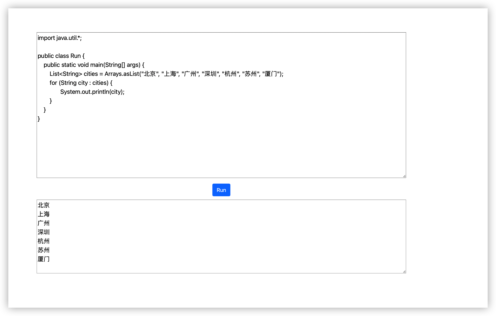

# OnlineExecutor
Java代码在线执行器
> 参考《深入理解Java虚拟机》9.3 实战：自己动手实现远程执行功能
# 功能
## Done
- [x] 自定义[ClassLoader](src/main/java/com/shao/execute/MyClassLoader.java)从而实现重复加载同一个类
- [x] 自定义[HackSystem](src/main/java/com/shao/execute/HackSystem.java)用于替换默认的输出流
- [x] 编写[ClassModifier](src/main/java/com/shao/execute/ClassModifier.java)用于将字节码中的`java/lang/System`替换为`com/shao/HackSystem`
- [x] 编写[StringSourceCompiler](src/main/java/com/shao/compile/StringSourceCompiler.java)，实现了动态编译功能。在内存中直接将源代码字符串编译为字节数组
- [x] 使用Spring Boot、Spring MVC搭建了一个系统，可以在线编译、运行Java代码

## TODO
- [ ] 完善HackSystem的并发同步问题
## 如何运行

### Maven

```bash
mvn spring-boot:run 
```

## 运行截图

# 技术细节
TODO

# CHANGE LOG
[CHANGE LOG](CHANGELOG.md)
